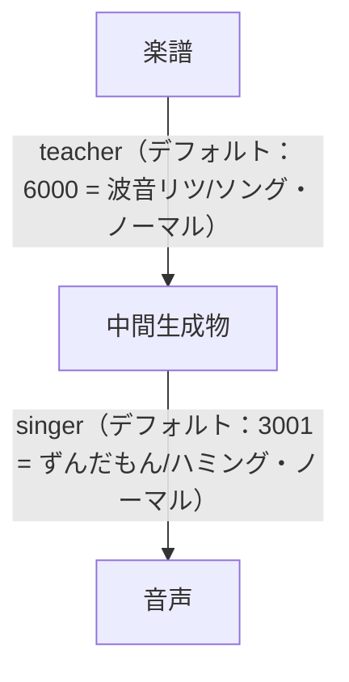
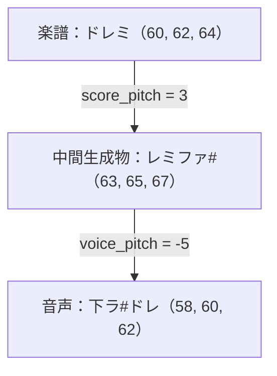

# 楽譜
- version 2

## 対応文字
- ひらがな→カタカナ、とそれぞれの濁点/半濁点なしに対応(例: `が, ガ, か, カ`)
- アルファベット→大文字/小文字に対応(例: `a, A`)
- 数字→全角と半角の数字に対応(例: `0, ０`)

```
[曲開始文字][区切り文字][音符|楽譜設定...]
```

## 曲開始文字
- 曲であることを示す文字
   - `歌`, `曲`, `s`
## 音符
```
[高さ基準?][高さ上下?][音][半音?][長さ?][連符?][付点?][読み?][区切り文字]
```
- 定義されていない文字は無視される
### 高さ基準
- その音がどの位置にあるか
- 数値 (デフォルト4)
- VOICEVOXでは-1から+9まで対応しているが、-1は未対応
### 高さ上下
- その音が高さ基準を超えたり下回った位置にいるか
- h/l (デフォルトなし)
  - h: `h`, `上`, `↑`
  - l: `l`, `下`, `↓`
### 音
- 音の種類
- ど,れ,み,ふ,そ,ら,し,休符
  - ど: `c`, `ど`
  - れ: `d`, `れ`
  - み: `e`, `み`
  - ふ: `f`, `ふ` ←1文字で判定するため、`ふぁ`ではなく`ふ`で判定
  - そ: `g`, `そ`
  - ら: `a`, `ら`
  - し: `b`, `し`
  - 休符: `n`, `m`, `ん`, `休`
### 半音
- 音が半音上がったり下がったりするか
- #/b (デフォルトなし)
  - #: `#`, `＃`, `♯`
  - b: `b`, `♭`
### 長さ
- その音の長さ(n分音符)
- 1, 2, 4, 8, 16 (デフォルト8)
  - 1: `1`
  - 2: `2`
  - 4: `4`, `-`, `ー`
  - 8: `8`
  - 16: `6`
### 連符
- その音が連符(3連付や5連符など)か
- 5 (デフォルトなし)
  - 5: `5`
- **連符を設定する時は長さの設定が必要**
### 付点
- その音が付点音符か(付点で長さが1.5倍)
- "+" (デフォルトなし)
  - `+`, `＋`, `.`, `。`
### 読み
- 読み方, /読み または _読み (デフォルト「ら」)
  - `/ら`, `_ら`, `＿ら`
- **この後は区切り文字以外入れてはいけない**
### 区切り文字
- 音符の終わりを示す
  - ` `(半角スペース, U+0020), `　`(全角スペース, U+3000), `\n`(改行, U+000A), `\r`(改行, U+000D), `\t`(タブ, U+0009), `;`, `；`

## 楽譜設定
```
{[設定...]}
[設定項目]=[設定内容][(設定が続く場合は) ","]
```
- 表記ゆれは対応しない
- 設定項目に`*`がついているものは楽譜のはじめでしか設定できない
- 設定項目に`+`がついているものは楽譜のはじめか、小節のはじめでしか設定できない
### `teacher`*
- 歌い方を指示するVOICEVOX Style ID
- VOICEVOX Styleでtypeが`singing_teacher`か`sing` (デフォルト: `6000`)
### `singer`*
- 歌うVOICEVOX Style ID
- VOICEVOX Styleでtypeが`frame_decode`か`sing` (デフォルト: `3001`)
### `score_pitch`*
- 楽譜を指定ピッチだけずらす
- 1オクターブ=`12`
- 整数 (デフォルト: `0`)
### `voice_pitch`*
- 生成音声を指定ピッチだけずらす
- 1オクターブ=`12`
- 整数 (デフォルト: `0`)
### `tempo`
- テンポ
- 数値 (デフォルト: `120`)
### `tempo_note`
- テンポの基準音符
- 整数 (デフォルト: `4`)

Style IDは以下のように利用されます
`teacher`と`singer`で利用できるキャラクターが異なります


pitchは以下のように適用されます


## 例
1. 「ド」から上の「ド」まで
```
歌 どー、れー、みー、ふぁー、そー、らー、しー、上どー。
s c- d- e- f- g- a- b- hc-
s c- d- e- f- g- a- b- 5c-
```
2. かえるのうた
```
s
c-,d-,e-,f- e-,d-,c-,n- e-,f-,g-,a- g-,f-,e-,n-;
c-,n-,c-,n- c-,n-,c-,n- c,c,d,d,e,e,f,f e-,d-,c-,n-;
```
